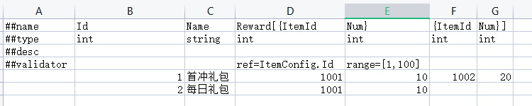
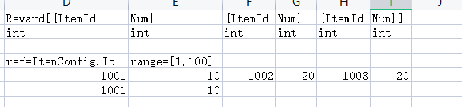

# TinyExcel2Json


## 游戏策划导表工具
将excel 转成 json

- 策划可灵活定制表结构
- 支持嵌套消息和数组, 扩展方便
- 支持嵌套消息或者数组分拆到各列, 方便策划拉表设计数值.
- 支持配置外键检查
- 无环境依赖, 一个exe即所有.

## 使用说明
- sheet表名需要设置为Config结尾, 转换为sheet表名.json
- 表结构支持无限层嵌套, 但是不建议使用超过两层, 以防止被同事劈. 
- 有限支持空值. 限制只能是array中子消息/子字段可以为空;比如奖励, 有的配5个物品, 有的配1个物品, 这个时候可以有多个为空.

## 配置检查
规则  
- ref (奖励包的itemId 必须在物品表中存在)
- range (数值范围) 
- (todo) 路径有效检查, 比如客户端资源配置 


## 举例说明
例子:奖励配置表

图中reward是奖励配置, 可以配置多个物品, 每个物品有一个ItemId和一个Num
表中配置了两个物品, 如果需要改成三个, 改成下图

这一步完全由策划控制, 完全不需要程序介入.

#### 列头
第一列属于特殊列:  
- ##name  字段名字  
- ##type  字段类型 
- ##desc  描述 
- ##validator  有效性检查 ref=ItemConfig.Id 表示该列值在ItemConfig Id列中必须存在

#### 表头
\#\# 属于特殊列头 参考列头
下面用 @@value 替代字段值
- Id 每个表都必须带
- Name 名字列, 普通列无特殊
- Reward[{ItemId : 说明该列开始了一个Array, 名字为Reward, 然后里面是多个对象, 对应json为 ```"Reward": [{ "ItemId": @@value ``` 
- Num} : 一个对象字段Num, 然后对象也结束. 对应json为 ``` "Num": @@value }```


## TODO 
- 多key作为id
- 导出时候区分服务器和客户端
- 配置检查 路径有效检查 (Todo)